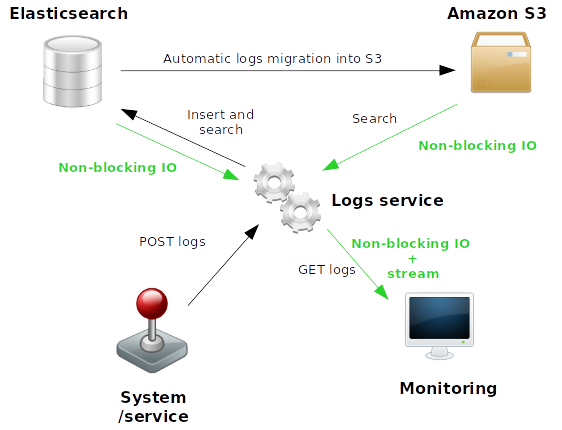

# aiohttp-elasticsearch-s3-logs-handler

Asynchronous non-blocking logs handler using Elasticsearch for short-term storage
and Amazon S3 for long-term storage.

## Project overview and status

### Overview

This project demonstrates an efficient way to handle log data using a combination of technologies:
* Aiohttp for the API layer
* ElasticSearch for short-term, searchable storage
* Amazon S3 for long-term, cost-effective storage

The system allows for quick insertion of log data through an Aiohttp API, which then stores the data in ElasticSearch for immediate access and analysis. Periodically, the data can be moved to S3 for archival purposes.

Four containers are included in the project:
* A Python development container with the Aiohttp service code (including tests)
* An ElasticSearch container for short-term log storage and quick searches
* A Kibana container linked to the ES container (for visualization and analysis)
* A fake S3 container for simulating data upload from ES to S3 (useful for local development and testing)

## Create the service

To set up the development environment, use Vagrant:

