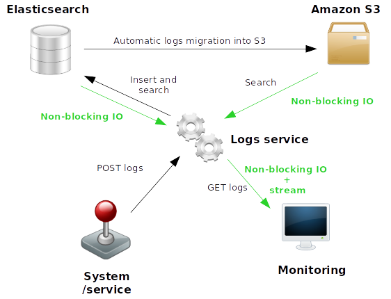

# aiohttp-elasticsearch-s3-logs-handler

Asynchronous non-blocking logs handler using Elasticsearch for short-term storage
and Amazon S3 for long-term storage.

## Project overview and status

### Overview

This project shows a simple way to insert data into ElasticSearch through Aiohttp API.
The logs (data) are inserted into ElasticSearch and can be uploaded to a S3 bucket.

# Project components
Four containers are included into the project:
* a Python development container with the Aiohttp service code (including tests),
* an ElasticSearch container,
* a Kibana container linked to the ES container (for tests purposes),
* a fake S3 container for data upload from ES

## Create the service

